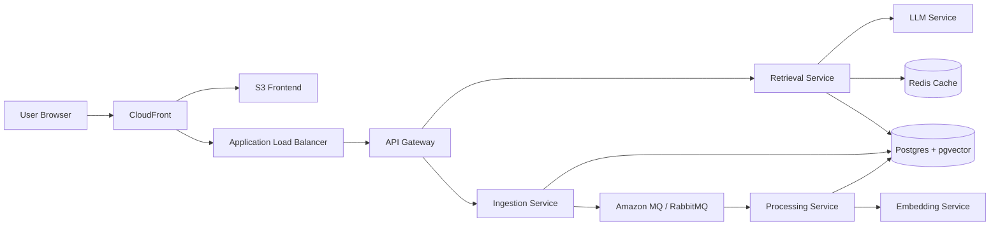

# OMSCS Lens

Course planning for Georgia Tech's OMSCS program, grounded in cited student
evidence.

[Live app](https://omscslens.com)

OMSCS Lens is a retrieval-augmented course-planning assistant. Ask questions
like "What should I know before taking Graduate Algorithms?" or "Compare ML,
AI, and Deep Learning for someone working full time" and get an answer backed
by source snippets from OMSCentral reviews and curated public student
discussion.

This project is unofficial and is not affiliated with Georgia Tech, OMSCS,
OMSCentral, or Reddit.

## What It Does

- Answers natural-language OMSCS course planning questions
- Retrieves relevant evidence from course reviews and curated discussion links
- Shows citations with source, date, match score, and original link
- Sorts citations by best match, newest, or oldest
- Browses and compares course workload, difficulty, ratings, and review counts
- Surfaces source coverage for each course
- Runs as a production AWS deployment at `omscslens.com`

## Why This Exists

OMSCS students make high-stakes course decisions from scattered information:
reviews, Reddit threads, syllabi, anecdotes, and half-remembered warnings from
older cohorts. OMSCS Lens tries to make that process calmer by turning those
materials into a cited Q&A experience.

It does not replace advising. It does not guarantee correctness. It helps you
find and inspect the evidence faster.

## Product Surface

The app has two primary views:

- **Ask**: a clean answer surface for course planning questions.
- **Courses**: a catalog view for filtering, comparing, and inspecting source
  coverage by course.

Priority course coverage currently focuses on:

`GA`, `ML`, `AI`, `CN`, `SDP`, `GIOS`, `AOS`, `DBS`, `HCI`, `ML4T`, `DL`, `RL`,
and `NLP`.

## Architecture

OMSCS Lens is built as a small RAG system with separate services for ingestion,
processing, retrieval, embedding, and generation.



### Services

- `api-gateway`: public HTTP entrypoint and route proxy
- `ingestion-service`: imports OMSCentral reviews and approved Reddit/source
  evidence
- `processing-service`: chunks documents, embeds them, and writes
  retrieval-ready rows
- `embedding-service`: wraps OpenAI embeddings with a deterministic local-dev
  fallback
- `retrieval-service`: hybrid dense/sparse retrieval, answer caching, and
  query orchestration
- `llm-service`: grounded answer generation over retrieved context

### Retrieval

The retrieval service uses hybrid search:

- dense search with pgvector cosine similarity
- sparse search with Postgres full-text search
- Reciprocal Rank Fusion to merge rankings
- Redis answer caching for repeated questions

## Data Pipeline

Postgres is the source of truth. RabbitMQ is the fast-path notification layer.
The processing service also runs reconciliation polling so a missed broker
event does not permanently strand a document.

```text
ingestion
  -> documents table
  -> document.ingested event
  -> processing queue
  -> chunks + embeddings
  -> retrieval-ready pgvector index
```

Reddit API access was not approved for automated ingestion, so Reddit evidence
is handled through curated/manual link workflows rather than an unattended
Reddit API scraper.

See [docs/reddit-link-discovery.md](docs/reddit-link-discovery.md) for the
current workflow.

## Local Development

Start the backend stack:

```bash
docker compose -f infra/docker-compose.yml up --build
```

Start the frontend:

```bash
cd frontend
npm install
npm run dev
```

The frontend runs at:

```text
http://localhost:5173
```

The API gateway runs at:

```text
http://localhost:8000
```

Override the API target with:

```bash
VITE_API_BASE_URL=http://localhost:8000 npm run dev
```

## Example Queries

```bash
curl -X POST http://localhost:8000/query \
  -H "Content-Type: application/json" \
  -d '{"question":"What should I know before taking Graduate Algorithms?","top_k":6}'
```

```bash
curl -X POST http://localhost:8000/query \
  -H "Content-Type: application/json" \
  -d '{"question":"Compare Machine Learning, AI, and Deep Learning for workload and payoff.","top_k":8}'
```

## Admin Workflows

Index OMSCentral course data:

```bash
curl -X POST http://localhost:8000/index/courses \
  -H "X-Admin-Token: $ADMIN_API_KEY" \
  -H "Content-Type: application/json" \
  -d '{"course_slugs":[],"missing_only":true,"include_reviews":true,"process_after":true}'
```

Check background job status:

```bash
curl -H "X-Admin-Token: $ADMIN_API_KEY" \
  http://localhost:8000/index/jobs/<job_id>
```

Import approved Reddit/source links:

```bash
API_BASE_URL="http://localhost:8000" \
ADMIN_API_KEY="$ADMIN_API_KEY" \
scripts/collect-and-import-priority-reddit.sh
```

Process pending documents directly:

```bash
curl -X POST http://localhost:8005/process \
  -H "X-Admin-Token: $ADMIN_API_KEY" \
  -H "Content-Type: application/json" \
  -d '{"limit":50,"max_batches":1}'
```

## Evaluation

Run a local retrieval eval:

```bash
PYTHONPATH=services/retrieval-service:. \
  python3 eval/run_retrieval_eval.py \
  --questions eval/questions.example.jsonl \
  --mode hybrid \
  --top-k 5
```

Use `--mode dense` to compare dense-only retrieval against hybrid retrieval.

## Observability

Every FastAPI service exposes Prometheus metrics at `/metrics`.

The local compose stack includes:

- Prometheus: `http://localhost:9090`
- Grafana: `http://localhost:3000`
- RabbitMQ management: `http://localhost:15672`

Grafana is provisioned with an `OMSCS Service Overview` dashboard covering
request rate, 5xx rate, p95 latency, in-flight requests, queue depth, and
scrape health.

## Production

Current production:

- Frontend: [https://omscslens.com](https://omscslens.com)
- Frontend hosting: S3 + CloudFront
- Backend: ECS Fargate behind an Application Load Balancer
- Database: RDS Postgres + pgvector
- Cache: ElastiCache Redis
- Queue: Amazon MQ / RabbitMQ
- Secrets: AWS Secrets Manager
- Scheduled refresh: EventBridge + Lambda
- Logs and alarms: CloudWatch

Deployment details live in:

- [docs/deployment.md](docs/deployment.md)
- [docs/aws-runbook.md](docs/aws-runbook.md)
- [docs/architecture.md](docs/architecture.md)

## Tests

```bash
PYTHONPATH=services/ingestion-service:. \
  python3 -m unittest services.ingestion-service.tests.test_omscentral

PYTHONPATH=services/ingestion-service:. \
  python3 -m unittest services.ingestion-service.tests.test_reddit

PYTHONPATH=. \
  python3 -m unittest services.processing-service.tests.test_messaging
```

Frontend build:

```bash
cd frontend
npm run build
```

## Responsible Use

OMSCS Lens is an unofficial planning tool. It should not be used as an
academic authority, advising replacement, or source of private Georgia Tech
content. Generated answers can be wrong; users should inspect citations and
verify important decisions against official course pages, syllabi, advisors,
and current program policies.

Do not use this project to post private course content, violate the Georgia
Tech Academic Honor Code, or misrepresent affiliation with Georgia Tech,
OMSCS, OMSCentral, or Reddit.

## Roadmap

- Saved course plans
- Personalized workload profiles
- Semester-by-semester planning reports
- Better source coverage dashboards
- Citation quality scoring
- Public feedback loop for incorrect or stale answers
